# Secure VPC Architecture on AWS (Bastion Host + NAT Gateway)

A secure network design on AWS: a web server in a **private subnet** with no public IP, reachable for administration only through a **bastion host**, with outbound internet through a **NAT Gateway**. Traffic is controlled by **Security Groups** (instance level) and a **Network ACL** (subnet level).

Built as part of my cloud computing internship at Codec Technologies (Project 10: Virtual Private Cloud with Secure Architecture).

**Region:** Asia Pacific (Mumbai) `ap-south-1`  |  **Built with:** AWS Console (manual setup)

---

## Architecture

```
                        Internet
                           |
                   [ Internet Gateway ]
                           |
 +-------------------- VPC 10.0.0.0/16 --------------------+
 |                         |                                |
 |   Public subnet 10.0.1.0/24 (ap-south-1a)                |
 |     - Bastion host (public IP, SSH from my IP only)      |
 |     - NAT Gateway (Elastic IP)                           |
 |                         |                                |
 |   Private subnet 10.0.2.0/24 (ap-south-1a)               |
 |     - Web server (Apache), NO public IP                  |
 |     - Default route 0.0.0.0/0 -> NAT Gateway             |
 +----------------------------------------------------------+
```

| Component | Configuration |
|---|---|
| VPC | `secure-vpc`, `10.0.0.0/16` |
| Public subnet | `public-subnet`, `10.0.1.0/24`, auto-assign public IPv4 on |
| Private subnet | `private-subnet`, `10.0.2.0/24`, no public IPs |
| Internet Gateway | `secure-igw`, attached to the VPC |
| NAT Gateway | `secure-nat`, in the public subnet, with an Elastic IP |
| Public route table | `public-rt`: `0.0.0.0/0` -> Internet Gateway |
| Private route table | `private-rt`: `0.0.0.0/0` -> NAT Gateway |
| Bastion security group | `bastion-sg`: inbound SSH (22) from my IP only |
| App security group | `app-sg`: inbound SSH (22) from `bastion-sg` only, inbound HTTP (80) from `10.0.0.0/16` |
| Network ACL | `private-nacl` on the private subnet (rules below) |
| Instances | 2 x `t3.micro`, Amazon Linux 2023 (`bastion-host`, `private-web-server`) |

### Network ACL rules (`private-nacl`)

| Direction | Rule | Protocol / Port | Source / Destination | Action |
|---|---|---|---|---|
| Inbound | 100 | TCP 22 (SSH) | 10.0.0.0/16 | Allow |
| Inbound | 110 | TCP 80 (HTTP) | 10.0.0.0/16 | Allow |
| Inbound | 120 | TCP 1024-65535 | 0.0.0.0/0 | Allow (return traffic) |
| Inbound | * | All | 0.0.0.0/0 | Deny |
| Outbound | 100 | TCP 1024-65535 | 10.0.0.0/16 | Allow (replies) |
| Outbound | 110 | TCP 80 | 0.0.0.0/0 | Allow |
| Outbound | 120 | TCP 443 | 0.0.0.0/0 | Allow |
| Outbound | * | All | 0.0.0.0/0 | Deny |

---

## How I built it

1. Created the VPC `10.0.0.0/16`.
2. Created the public (`10.0.1.0/24`) and private (`10.0.2.0/24`) subnets and enabled auto-assign public IPv4 on the public subnet only.
3. Created and attached the Internet Gateway.
4. Created `public-rt` with a default route to the Internet Gateway and associated it with the public subnet.
5. Created the NAT Gateway in the public subnet with a new Elastic IP.
6. Created `private-rt` with a default route to the NAT Gateway and associated it with the private subnet.
7. Created the security groups `bastion-sg` and `app-sg` (rules above).
8. Created the custom Network ACL `private-nacl` and associated it with the private subnet.
9. Created an SSH key pair and launched the bastion host (public subnet) and the web server (private subnet, public IP disabled). The web server's user data installs Apache and creates a test page.
10. Ran the verification tests below.

---

## Verification and results

### 1. Bastion has a public IP, the private server does not
The bastion host has a public IPv4 address; the private web server only has a private address (`10.0.2.208`).

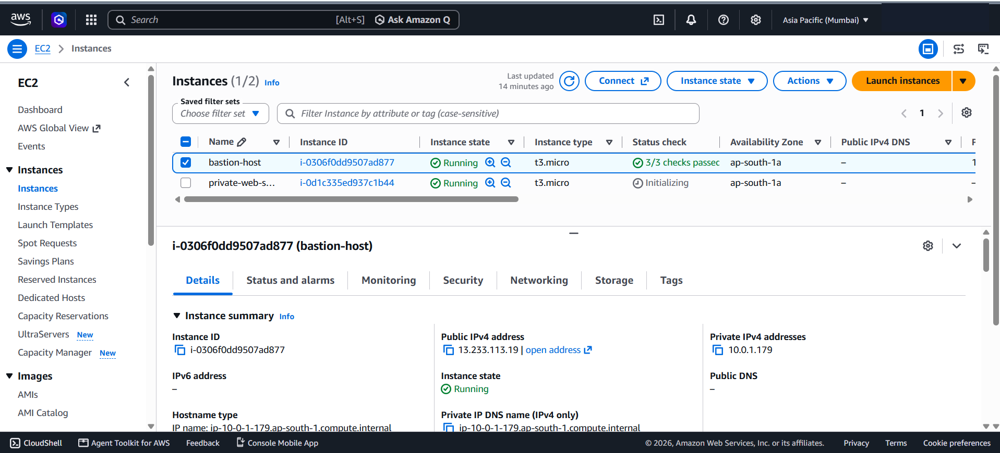
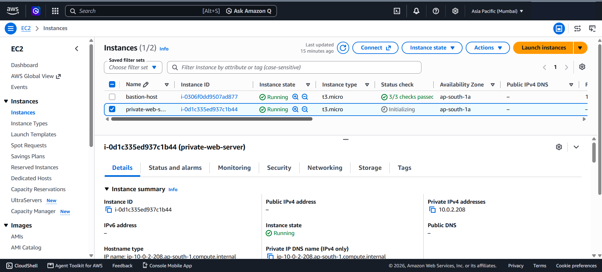

### 2. Test A: direct SSH to the private server from the internet is blocked
SSH straight to `10.0.2.208` from my laptop times out, so the private server is not reachable from the internet.

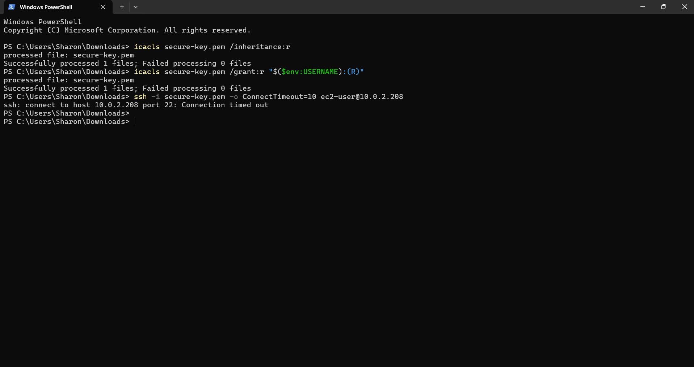

### 3. Test B: SSH into the bastion host works
Only my IP can reach the bastion on port 22.

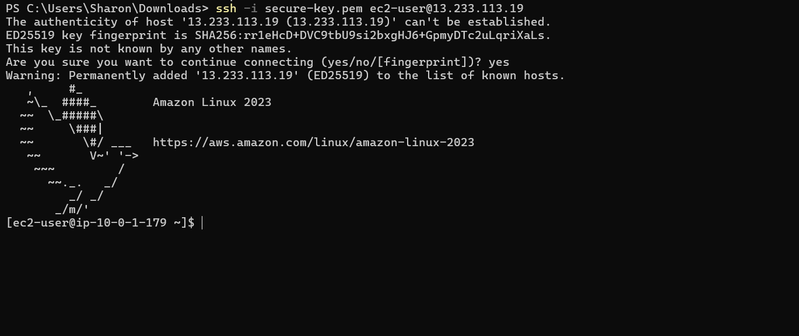

### 4. Private server has outbound internet through the NAT Gateway
From the private server, `curl -I https://aws.amazon.com` returns `HTTP/2 200` even though the server has no public IP.

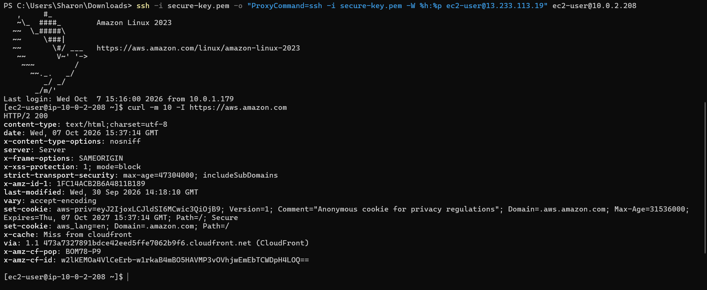

`curl ifconfig.me` from the private server returns `13.202.70.157`, which is the NAT Gateway's Elastic IP, confirming traffic leaves through the NAT. The web server also responds locally with the test page.

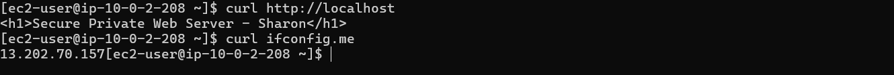
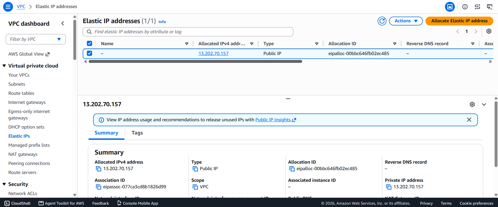

### 5. Network ACL rules
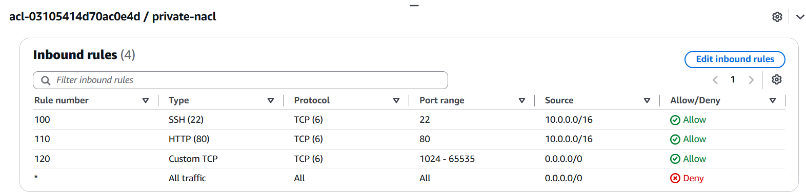
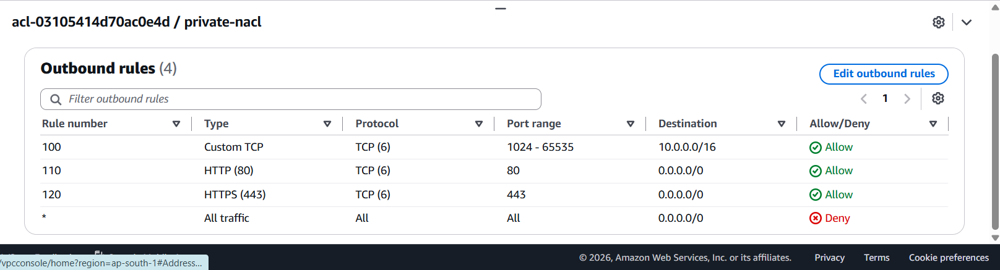

### 6. Routing and security groups
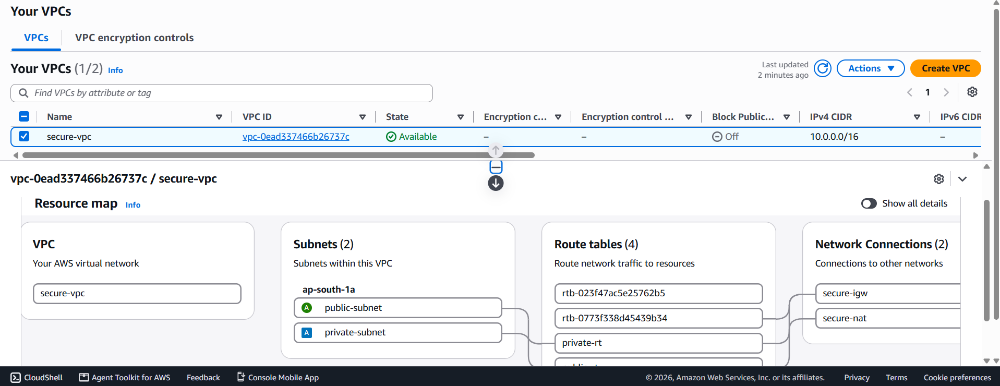
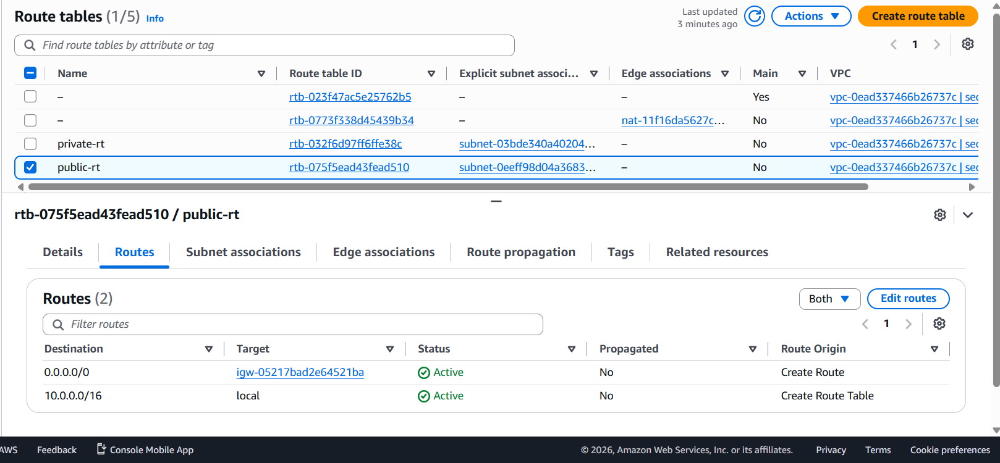
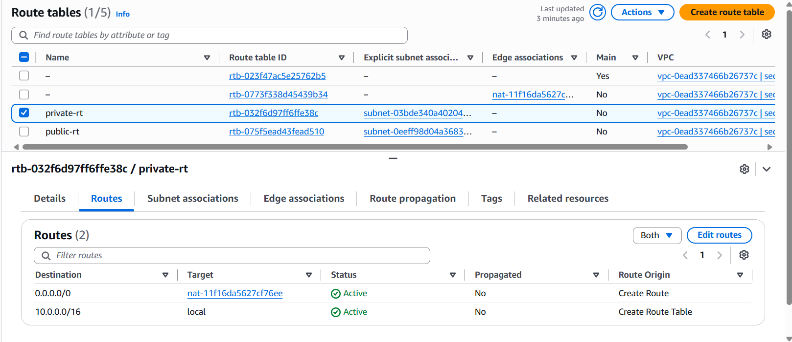
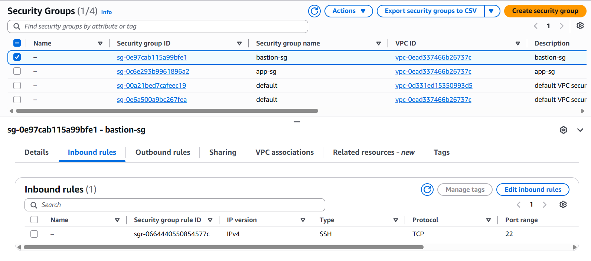
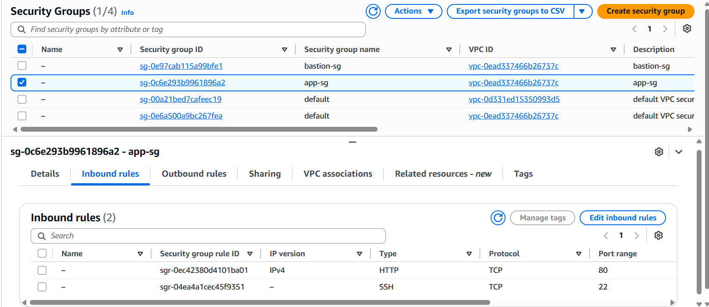

---

## Security decisions

- **No public IP on the web server.** It cannot be reached directly from the internet (Test A).
- **Bastion host as the single entry point.** Administration goes through one hardened host, and its security group only allows SSH from my own IP.
- **Security group chaining.** `app-sg` allows SSH only from `bastion-sg`, not from an IP range, so no other host can reach the private server on port 22.
- **NAT Gateway for outbound-only access.** The private server can download updates but nothing on the internet can start a connection to it.
- **Defense in depth with a Network ACL.** `private-nacl` is a stateless second layer with a default deny at the subnet boundary.
- **Least privilege on ports.** Only SSH, HTTP, HTTPS and the ephemeral return-traffic range are allowed.
- **No keys in the repo.** The SSH private key (`.pem`) is never committed.

## Troubleshooting notes

- The web server did not start after the first launch, so `curl` to port 80 failed instantly. I installed and started Apache manually after confirming the instance had internet access.
- `dnf install` initially timed out because the private subnet's outbound path was not working. Moving the subnet to the default NACL temporarily, then verifying the NAT Gateway and `private-rt` route, restored access.
- On Windows, `ssh -J` did not pass the key to the bastion hop. Using `-o ProxyCommand="ssh -i key.pem -W %h:%p ec2-user@<bastion>"` fixed it.

## Cost and cleanup

The NAT Gateway is the only hourly-billed component here, so after capturing the screenshots all resources were deleted: both EC2 instances terminated, the NAT Gateway deleted, the Elastic IP released, and the VPC removed.

## Possible improvements

- Write the whole stack as Terraform or CloudFormation.
- Add a second Availability Zone with a second private subnet and an Application Load Balancer.
- Enable VPC Flow Logs to CloudWatch.
- Replace the bastion with AWS Systems Manager Session Manager.

## Author

Sharon, B.Tech Information Technology (Cybersecurity)
GitHub: https://github.com/saradel22
